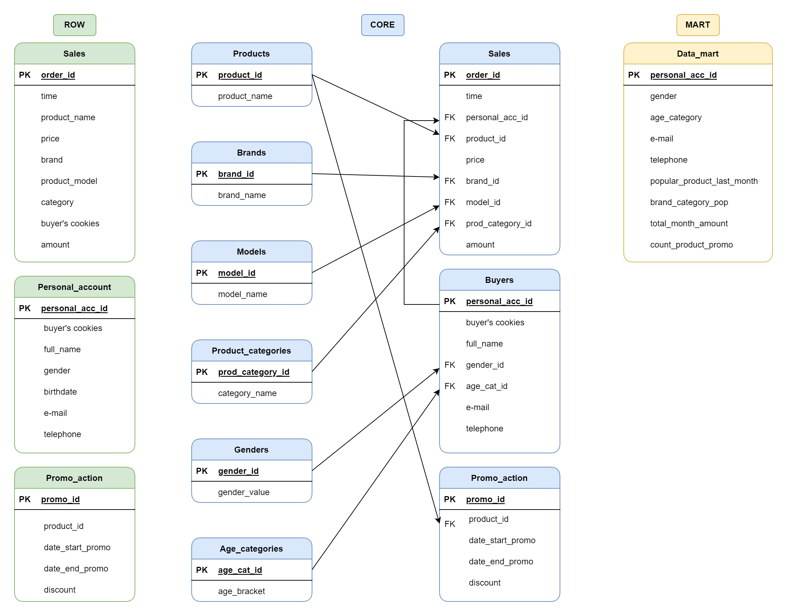

# Тема 2.6 "Погружение в DWH".
# Задание. 

```
Ваш руководитель после прохождения курсов по «Data driven big data artificial intelligence» поставил 
вам задачу — спроектировать целое DWH!

Ваш начальник хочет, чтобы DWH объединяло данные всех отделов организации. Однако вы предпочитаете 
пошаговый подход, поэтому вашей первоочередной задачей является создание связи между данными отдела 
продаж и данными отдела маркетинга.

У вас есть следующие входные данные:

-   Информация о продажах (id заказа, время продажи, название товара, цена, бренд, модель товара, 
    категория, cookies покупателя, сумма)

-   Информация о личных кабинетах покупателей (id личного кабинета, cookies покупателя, ФИО, пол, дата 
    рождения, email, телефон)

-   Информация о промо-акциях (id промо-акции, id товара, дата начала промо, дата окончания промо, 
    размер скидки)

Вся эта история нужна для того, чтобы аналитики могли лучшим образом формировать целевую аудиторию для 
будущих рекламных акций. Таким образом на выходе у вас должна получится витрина, которая будет содержать 
следующую информацию:

-   id личного кабинета

-   Пол

-   Категория возраста

-   Электронная почта

-   Телефон

-   Товар, который чаще всего покупал клиент за последний месяц

-   Бренд и категория товаров, которые чаще всего покупал клиент

-   Сумма, потраченная клиентом за месяц

-   Количество товаров, купленных со скидкой

Ваша основная задача — спроектировать DWH с использованием слоев raw, core и mart. В качестве решения 
предложите ER-диаграмму вашего будущего DWH.
```

## ER-диаграмма:

