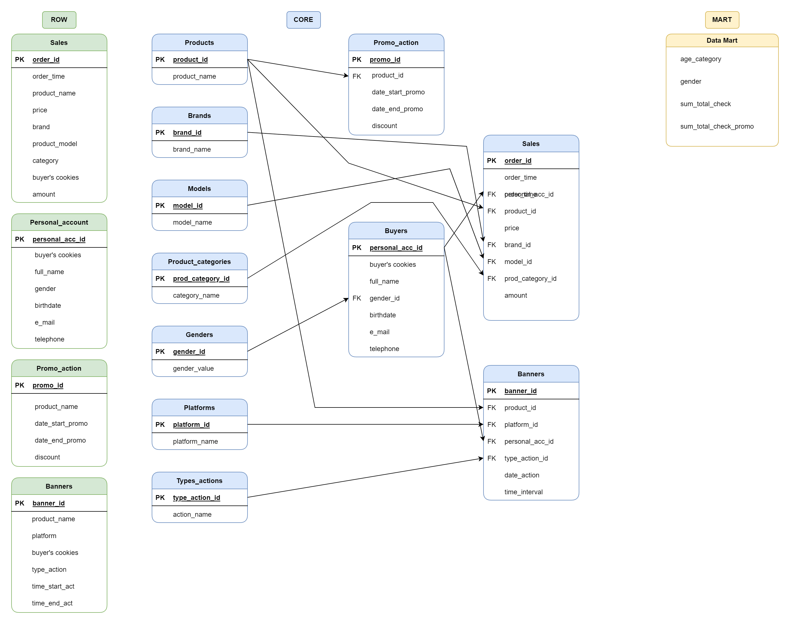

# Проект по итогам модуля.

```
В качестве ключевой задачи промежуточного проекта вам необходимо собрать воедино все знания полученные 
на предыдущих этапах обучения, а именно:

    - docker-compose файл, который включает в себя:

        + сервис развертывания PostgreSQL

        + Одно из 2-х: либо сервис(ы) развертывания Superset, либо сервис(ы) развертывания Clickhouse

    - Сервис развертывания PostgreSQL должен содержать в себе:

        + ddl-скрипты для инициализации всех 3-х слоев будущего DWH - в качестве примера можно взять DHW 
        из раздела 2.6, либо разработать свое.

        + dml-скрипты для наполнения слоев данными

        + соответствующие volume для сохранения прогресса в работе контейнера

    Если вы выберите развертывание сервиса Superset, то вам необходимо на уровне ddl скриптов заложить 
    создание таблиц на слое mart, которые составят основу будущих дашбордов. Логика и данные для 
    дашборда могут быть достаточно простыми, но осмысленными. В качестве результата вам нужно будет 
    приложить скрин полученного дашборда.

    Если вы выберите развертывания сервиса Clickhouse, то вам необходимо на уровне ddl скриптов заложить 
    создание таблиц на слое mart, которые необходимо перенести с помощью инструментов миграции в СУБД 
    Clickhouse. Скрипт миграции так же должен быть проинициализирован автоматически при создании 
    контейнера с Clickhouse.

    Также вам необходимо приложить к решению логическую модель вашего DWH в виде ER-диаграммы, а также 
    README-файл с описанием логики работы приложения.

    Расширение функционала всячески приветствуется и поощряется. 
```

## Логическая структура базы данных:



## Графическая структура базы данных:


## Слой RAW: 
    Информация о продажах (id заказа, время продажи, название товара, цена, бренд, модель товара, категория, cookies покупателя, количество товара)

    Информация о личных кабинетах покупателей (id личного кабинета, cookies покупателя, ФИО, пол, дата рождения, email, телефон)

    Информация о промо-акциях (id промо-акции, наименование товара, дата начала промо, дата окончания промо, размер скидки)

    Информация о прохождении баннерной рекламы: (id баннера, наименование товара, площадка размещения, cookies пользователя, тип действия (просмотр или клик), время начала действия, время окончания действия).

## Слой MART:
    На выходе получилась витрина, которая содержит следующую информацию: 
    - категория возраста покупателя:
        + 18 и моложе;
        + 19 - 24;
        + 25 - 34;
        + 35 - 44;
        + 45 и старше.
    - пол покупателя;
    - общая сумма покупок за месяц;
    - общая сумма покупок товаров по промо акциям.
    


### 1. SQL-скрипт для создания таблиц:
Файл: [DDL-script](sql_scripts/ddl/1_ddl.sql)

### 2. SQL-скрипт для заполения таблиц:
Файл: [DML-script](sql_scripts/dml/2_dml.sql)

### 3. SQL-скрипт витрины данных:
Файл: [Data mart script](sql_scripts/3_data_mart.sql)

### 4. Файл Docker-compose:
Файл: [Docker-compose](docker-compose.yml)


### Для развертывания базы "Планирование продаж" необходимо:
1. Скачать архив из репозитория;
2. Распаковать в нужную папку;
3. В терминале перейти в папку с базой данных и выполнить команду ***docker-compose up -d***;
4. Запустить DBeaver, port 5436, наименование базы данных (sales_planning_pro), логин (postgres), пароль (password);
5. Посмотреть результаты отработанного скрипта 3_data_mart.sql можно в DBeaver'е, запустив каждую задачу последовательно, или посмотреть логи командой: ***docker logs sales_planning_pro***.