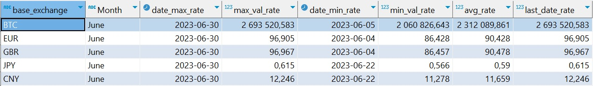

# Задание 3.2 new PRO
```
Задание ПРО (новое)

1. Повторите все те же шаги, что и в базовой-версии, но добавьте еще несколько валют для исследования. Для каждой пары 
валют создайте отдельную таблицу.

2. Изменения также коснутся и итоговой таблицы, в который для каждой новой исследуемой пары валют вам необходимо 
произвести новые расчеты, но на этом шаге они все должны быть в одной таблице.

3. Соберите всю логику в отдельное python-приложение и добавьте в docker-compose совместно с сервисом для СУБД Postgres. 
Учитывайте особенности установки дополнительных модулей языка Python.


В качестве результата предоставьте docker-compose файл, который содержит 2 сервиса:

    - СУБД Postgres,

    - Python-приложение, которое реализует логику из задания.

 

По итогу выполнения всех пунктов задания вам необходимо прислать ссылку на ваш репозиторий.
```

### 1. Файл app_start.py парсинга курса 5 видов валют за 1 календарный месяц (июнь 2023 года)


### 2. Файл программы подключения к Postgres с помощью Python и создания таблиц по 5 курсам валют и итоговой таблицы.


### 3. Файл - скрин созданной таблицы ***total_exchange_rates*** (вид из DBeaver'а), содержащей данныые:
    - валюта значений (base_exchange);
    - месяц выводимых данных (Month);
    - дата максимального значения валюты (date_max_rate);
    - максимальное значение валюты (max_val_rate);
    - дата минимального значения валюты (date_min_rate);
    - минимальное значение валюты (min_val_rate);
    - среднее значение за месяц (avg_rate);
    - курс BTC на последний день месяца (last_date_rate).



### 4. Файл Jupiter Notebook, в котором писался и тестировался код программы:


### Для развертывания базы "exchange" необходимо:
1. Скачать архив из репозитория;
2. Распаковать в нужную папку;
3. В терминале перейти в папку с базой данных и выполнить команду ***docker-compose up -d***;
4. Для работы с DB "exchange":
    - port: "5432", 
    - наименование базы данных: "exchange", 
    - логин: "postgres", 
    - пароль: "password".