# Задание 3.4 Погружение в Airflow
```
У вас получился прекрасно работающий dag, однако его еще можно улучшить! Для этого необходимо сделать 
следующие шаги:

    1. Вынести параметры для вызова API в airflow variables.

Зачем? Подобные конфигурационные параметры должны иметь возможность изменяться без погружения в сам код.

Создайте новую переменную в интерфейсе Airflow, перенесите в нее значение url(

Exchangerate.host - Unlimited & Free foreign, crypto exchange rates with currency conversion & EU VAT 
rates API) и названия валют, а затем импортируйте в код вашего dag’a.

    2. Вынести подключение к БД в airflow connections.

Зачем? Данные для подключения небезопасно хранить в коде, и они также должны быть доступны всем 
разработчикам, работающим с airflow.

Также через интерфейс airflow создайте новое подключение к PostgresDB и перенесите туда все данные:


Обратите внимание на host — данный host соответствует внутреннему адресу контейнера с базой внутри 
docker-compose.

Протестируйте ваше соединение в рамках интерфейса airflow перед использованием. Как только соединение 
будет успешно установлено, импортируйте подключение в ваш airflow dag.

По итогу выполнения всех пунктов задания вам необходимо прислать ссылку на ваш репозиторий.
```
## Для развертывания Airflow в Docker необходимо:
1. Скачать архив из репозитория;
2. Распаковать в нужную папку;
3. В терминале перейти в папку, в которой находится 'docker-compose.yml' и выполнить команду ***docker-compose up -d***;
4. Файл со скриптом создания DAG: [my_calc_rates.py](./airflow/dags/my_calc_rates.py)

PS: для удобства проверки задания Variables закоммичен в файле [my_calc_rates.py](./airflow/dags/my_calc_rates.py), чтобы скопировать 
оттуда его параметры и прописать в web-интерфейсе. 

## Скрины работы приложения:

### 1. GRAPH.
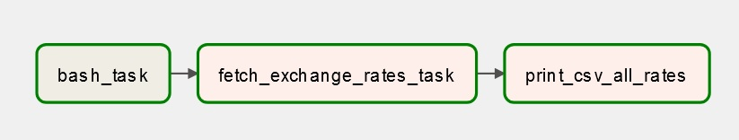

### 2. Файл - скрин BashOperator с выводом в логи фразы «Good morning my diggers!»: 
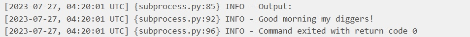

### 3. Файл - скрин Connections: 
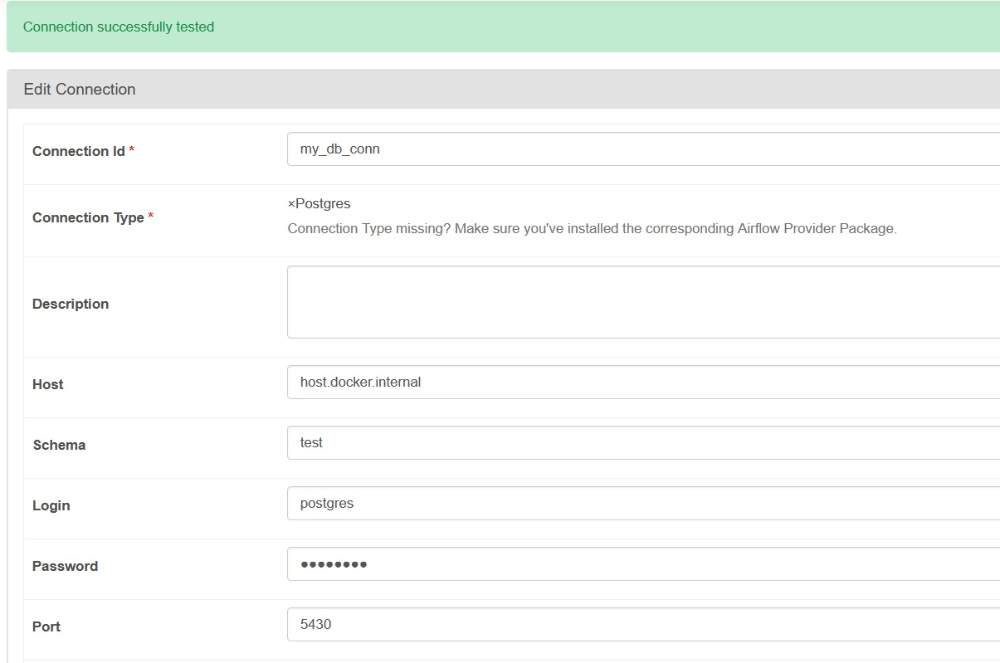

### 4. Файл - скрин Variables: 
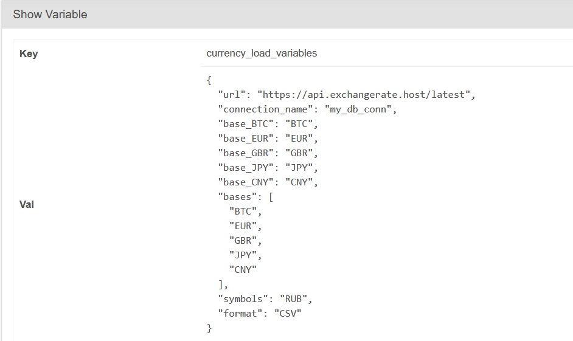

### 5. Файл - скрин PythonOperator, в котором парсятся валюты, создаются и заполняюся таблицы:
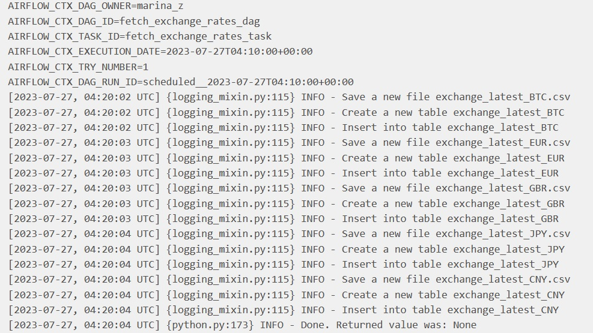

### 6. Файл - скрин сводной таблицы трех последних значений по каждому курсу (выводится вв log):
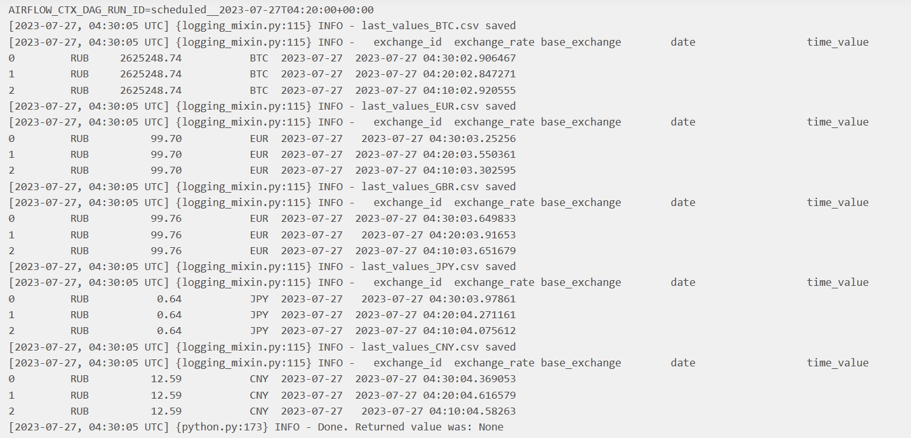

### 5. Файлы - скрины последних трех записей таблиц в DBeavere по каждому курсу валют:
#### - BTC
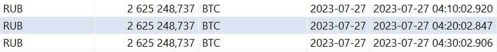
#### - CNY
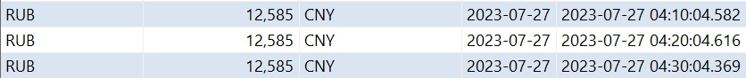
#### - EUR
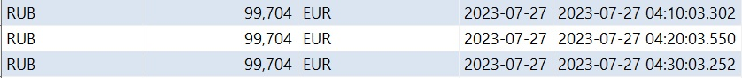
#### - GBR (почему-то сайт "отдает" название EUR, но значение выводит правильное, курс английского фунта стерлингов)
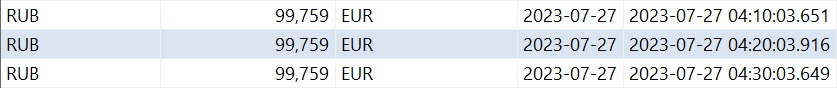
#### - JPY
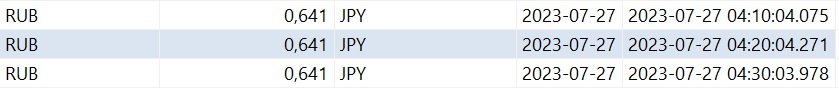
