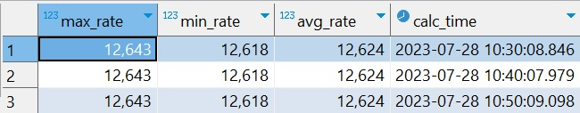

# Задание 3.4 Погружение в Airflow
```
Задание ПРО (новое)

    Разделите логику вашего Python-оператора из предыдущего задания следующим образом:

    В отдельном операторе получите значения из API и запишите их в XCOM.

    В следующем операторе получите эти значения из XCOM и запишите в базу.

    Добавьте в начало вашего dag’a оператор, который вычисляет количество строк в базе и записывает в
    специальную переменную airflow.

    Добавьте SensorOperator, а за ним еще один оператор, который рассчитывает следующие показатели:

    максимальное значение курса,

    минимальное значение курса,

    среднее значение курса за весь период

и добавляет (обновляет) эти показатели в отдельную таблицу. Логика аналогична пункту 3 в задании 3.2. 
При этом скрипт расчета показателей должен запускаться только в том случае, если в таблице появилась 
новая запись. При этом в случае невыполнения условия airflow dag должен игнорировать пересчет последнего 
оператора и «мягко» завершаться.

По итогу выполнения всех пунктов задания вам необходимо прислать ссылку на ваш репозиторий.
```
## Для развертывания Airflow в Docker необходимо:
1. Скачать архив из репозитория;
2. Распаковать в нужную папку;
3. В терминале перейти в папку, в которой находится 'docker-compose.yml' и выполнить команду ***docker-compose up -d***;
4. Файл со скриптом создания DAG: [my_calc_rates.py](./airflow/dags/my_calc_rates.py)

PS: для удобства проверки задания Variables закоммичен в файле [my_calc_rates.py](./airflow/dags/my_calc_rates.py), чтобы скопировать 
оттуда его параметры и прописать в web-интерфейсе. 

## Скрины работы приложения:

### 1. GRAPH.


### 2. Файл - скрин BashOperator с выводом в логи фразы «Good morning my diggers!»: 


### 3. Файл - скрин Connections: 


### 4. Файл - скрин Variables: 


### 5. Файл - скрин мягкого завершения Dag'а в случае отсутствия новой строки в таблице: 


### 6. Файлы - скрины таблиц расчета средних значений для валюты:
#### - BTC

#### - CNY

#### - EUR

#### - GBR (почему-то сайт "отдает" название EUR, но значение выводит правильное, курс английского фунта стерлингов)

#### - JPY

