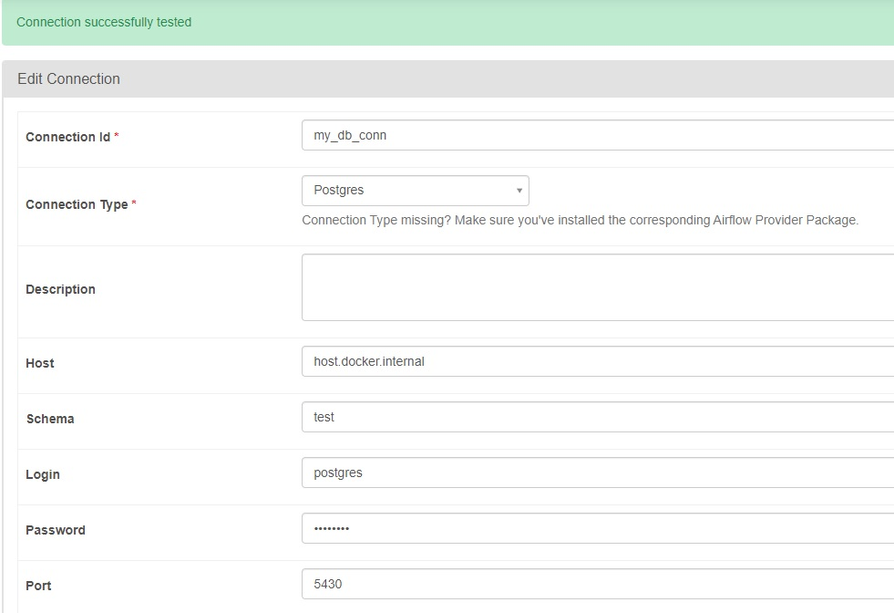
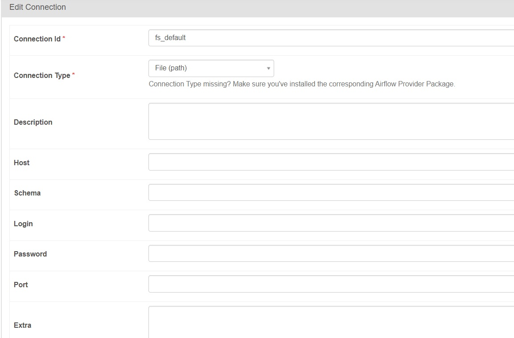
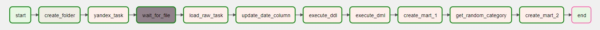
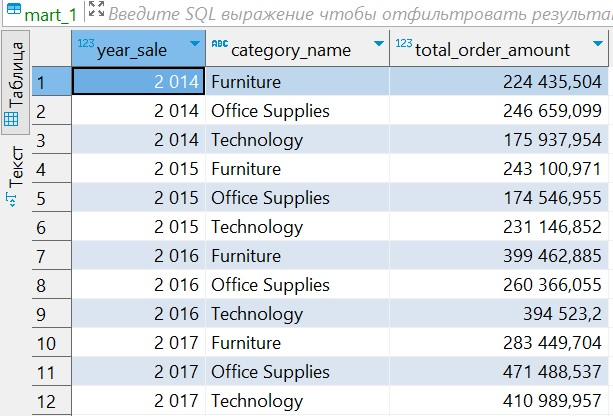
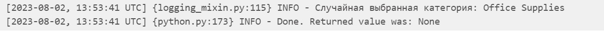
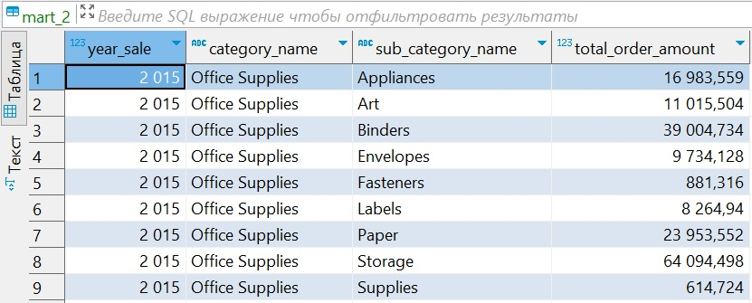
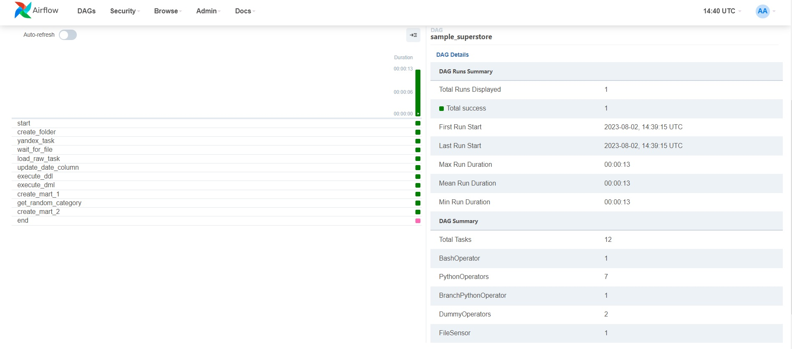

# Задание 3.4 ПРО
```
Задание ПРО

    Создайте переменную (Admin->Variables), в которой пропишите путь к raw_data

    Создайте connection (Admin->connections), в котором пропишите настройки соединения к БД raw_store

В новом созданном DAGe

    Создайте пустой таск, используя DammyOperator, назовите его “start”

    Далее, используя BashOperator, создайте таск, который создаст папку /raw_data/supermarket_1

    Далее, используя PythonOperator создайте таск, который загружает данные из csv файла (

    Yandex в raw_store как есть.
    При выполнении данного пункта используйте созданное соединение (connection)

    Дополните ваш DAG, написав Sendor, который проверяет наличие файла в папке /raw_data/supermarket_1
    Загрузку данных на шаге 5. Осуществлять, если файл существует

 

Задание 2 (формирование CORE)

    Напишите таск или группу тасков, которые формируют CORE-слой
    CORE слой должен быть нормализован. (архитектуру CORE выбирайте сами)

Примечание: формирование CORE-слоя можно сделать на этапе развертывания airflow (в докер-compose) при помощи скриптов

    Далее, напишите таск, который реализует следующую логику:

    a) Ваши загруженные данные содержат столбцы Order Date и Ship Date с датами в виде MM/DD/YYYY
    b) Ваша задача преобразовать данные в указанных столбцах к виду YYYY-MM-DD
    c) Отфильтровать исходный источник данных и выбрать данные, относящиеся только к корпоративному сегменту
    d) Полученную отфильтрованную выборку записать базу core_store

    Варианты реализации: (можете выбрать любой)
    1. Используйте PythonOperator, а также библиотеку psycopg2 для работы с БД Postgres
    2. Используйте PostgresOperator

 

Задание 3. Формирование Data MART

Для отчетности, аналитики запросили следящие данные.

 

Витрина 1
Вывести по каждому году, общую сумму заказов по категориям корпоративного сегмента.
Данную витрину записать в mart_store

Витрина 2

    Используя PythonOperator напишите task, который случайным образом возвращает одно из возможных значений атрибута 
    "Category" в наборе данных о заказах супермаркета.

    Использовать механизм XCOM для передачи полученного значения Category (п.1) следующей задаче (см.п.3)

    Напишите task, который реализует следующую логику: в зависимости от возвращенного значения Category найдите итоговую
    сумму заказов по каждой из суб-категорий выбранной категории в корпоративном сегменте за 2015 год. Результат 
    вычислений запишите в mart_store

Для выполнения данного пункта, использовать BranchPythonOperator

    Далее, Создайте пустой таск, используя DammyOperator, назовите его “end”

В результате выполнения задания необходимо предоставить:

    Исходный код DAGa

    Скриншот построенного DAGa в Airflow

    Скриншот витрины mart_store

Результат выполнения задания необходимо выложить в github/gitlab и указать ссылку на Ваш репозиторий (не забудьте — 
репозиторий должен быть публичным).
```
## Для развертывания Airflow в Docker необходимо:
1. Скачать архив из репозитория;
2. Распаковать в нужную папку;
3. В терминале перейти в папку, в которой находится 'docker-compose.yml' и выполнить команду ***docker-compose up -d***;
4. Файл со скриптом создания DAG: [my_calc_rates.py](./airflow/dags/my_calc_rates.py)
5. Запустить Airflow в браузере по адресу: http://localhost:8080;
6. Создать connection (Admin->connections), в котором прописать настройки соединения к БД raw_store, как показано 
на скриншоте: ;
7. Создать connection (Admin->connections) для работы FileSensor, который проверяет наличие файла в папке, как показано
на скриншоте: ;
PS: для удобства проверки задания Variables создан в коде файла [my_calc_rates.py](./airflow/dags/my_calc_rates.py).

## Скрины работы приложения:

### 1. GRAPH.


### 2. Файл - скрин ER диаграммы: 


### 3. Файл - скрин Витрины 1: 


### 4. Файл - скрин вывода на печать случайной категории в log: 


### 5. Файл - скрин Витрины 2: 


### 6. Файл - скрин запуска DAG: 

