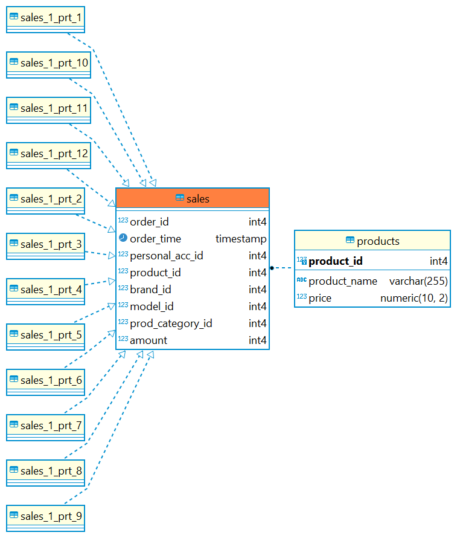

# Задание 3.4.
```
Задание
Дело зашло слишком далеко — ваши таблички с курсами валют обвалили базу! На собрании по разбору полетов вы мужественно 
взяли на себя ответственность за случившееся, и за такой смелый поступок на вас взвалили задачу по переносу уже 
старенькой базы Postgres на новенький кластер Greenplum. 

Первым делом Greenplum надо «поднять» — для этого у вас есть два пути:

Обратиться к devOps-инженеру, который думает наперед и уже подготовил для вас тестовый кластер с GP: 

host: 146.120.224.166

port: 5462

За получением учетной записи обратитесь, пожалуйста, в телеграм-бот поддержки

Подключиться можно с помощью dBeaver (выбрать тип соединения Postgres) или аналогов.

Самостоятельно развернуть официальный образ GreenPlum, который доступен из официальной документации: Building your own 
GPDB open source docker – Greenplum Database.

GP — в отличии от Postgres — распределенная система хранения данных. Поэтому ключевое, чему надо научиться — правильно 
распределять данные по узлам кластера. Создайте таблицу-фактов о продажах произвольных товаров. При создании таблицы 
укажите поле для разделения таблицы по сегментам. Учитывайте, что правильные сегменты должны быть одинакового размера и 
не иметь пустых записей. Также при создании таблицы выберите поле для партиционирования. Лучшее поле для создания 
партиции — поле с единицей времени (год, месяц, день и т.д.).

Создайте таблицу-измерение, в которой отражены стоимость и название товара, а также связь с таблицей-фактов из 
предыдущего шага.

Заполните таблицы минимальными данными. Включите оптимизатор GP. 

Напишите запрос, который рассчитывает сумму продаж определенного товара за определенную единицу времени. 

Напечатайте план предыдущего запроса. 

В качестве результата необходимо предоставить код всех запросов и план последнего запроса. 

Результат выполнения задания необходимо выложить в github/gitlab и указать ссылку на Ваш репозиторий (не забудьте: 
репозиторий должен быть публичным).
```
### Для работы в Greenplum я обратилась к devOps-инженеру 😎, который думает наперед и заранее подготовил для меня тестовый кластер с GP: 

host: 146.120.224.166

port: 5462.

## sql-script задания: [sql_scripts.sql](sql_scripts.sql)

## Скрины работы приложения:

### 1. Файл - скрин ER диаграммы: 


### 2. Файл - скрин запроса, который рассчитывает сумму продаж товара product_id = 13 за определенную единицу времени c 01.06.2023 по 20.06.2023г.: 


### 3. План предыдущего запроса в формате .txt: 
[_EXPLAIN_SELECT_product_name_sum_price_amount_AS_total_sales_FRO_202308090317.txt](_EXPLAIN_SELECT_product_name_sum_price_amount_AS_total_sales_FRO_202308090317.txt)


