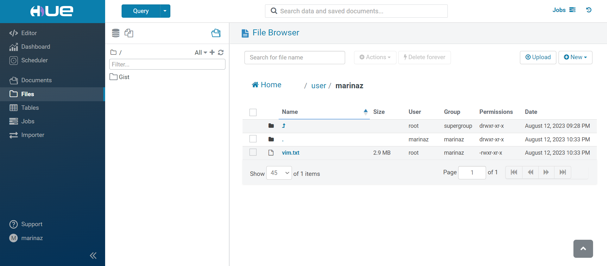

# Задание 4.4 Введение в Hadoop
```
Задание
Что может быть прекраснее летнего корпоратива? Особенно если корпоратив пройдет в Таиланде! Да-да, отчетный период 
показал очень хорошую прибыль вашей компании — и не без вашего участия! Чтобы поощрить за труд и терпение, ваш начальник
решил организовать корпоратив прямо на островах. По приезду на место первое, что попало на глаза вам и вашим коллегам, 
— это цирковое шоу слонов. Зрелище было замечательным, у вас возникла невольная ассоциация и вы воскликнули: «О, оживший
Hadoop!». Что же, инициатива, как говорится, ложится на плечи инициатора. Теперь ваш начальник под двойным впечатлением 
поставил вам первоочередную задачу после отпуска — завести hadoop для задач вашей компании. 
Беремся за дело — и уже по традиции ищем нужный образ docker. 
Находим его здесь: https://github.com/tech4242/docker-hadoop-hive-parquet
Устанавливается он весьма просто:
git clone https://github.com/tech4242/docker-hadoop-hive-parquet (в заранее созданной папке)

cmd → docker-compose up

Отлично, как только образ собран, а контейнер поднят — заходим по http://localhost:8888/hue и попадаем в HUE. 
Придумываем произвольную пару логина-пароля для будущей авторизации и приступаем к работе. 

Вспоминаем уроки литературы — переходим на следующий ресурс и скачиваем все доступные тома произведения «Война и мир» 
Л.Н. Толстого: https://all-the-books.ru/authors/tolstoy-lev-nikolaevich/
```
#### Файлы скачаны и лежат в папке:  [files](./files/)


#### Находим CONTAINER ID "datanode-1":
input:

```C:\Users\mazav>docker ps```

output:
```
CONTAINER ID   IMAGE                                                    COMMAND                  CREATED             STATUS                       PORTS                                          NAMES
70882e77e923   gethue/hue:4.6.0                                         "./startup.sh"           About an hour ago   Up About an hour             0.0.0.0:8888->8888/tcp                         docker-hadoop-hive-parquet-hue-1
139a9877dd82   bde2020/hive-metastore-postgresql:2.3.0                  "/docker-entrypoint.…"   About an hour ago   Up About an hour             0.0.0.0:5432->5432/tcp                         docker-hadoop-hive-parquet-hive-metastore-postgresql-1
c1a41e8eed3e   bde2020/hadoop-datanode:2.0.0-hadoop2.7.4-java8          "/entrypoint.sh /run…"   About an hour ago   Up About an hour (healthy)   0.0.0.0:50075->50075/tcp                       docker-hadoop-hive-parquet-datanode-1
5b4e97fc8933   bde2020/hive:2.3.2-postgresql-metastore                  "entrypoint.sh /opt/…"   About an hour ago   Up About an hour             10000/tcp, 0.0.0.0:9083->9083/tcp, 10002/tcp   docker-hadoop-hive-parquet-hive-metastore-1
0614e6356ea7   bde2020/hadoop-namenode:2.0.0-hadoop2.7.4-java8          "/entrypoint.sh /run…"   About an hour ago   Up About an hour (healthy)   0.0.0.0:50070->50070/tcp                       docker-hadoop-hive-parquet-namenode-1
5b5e6ebd3757   bde2020/hive:2.3.2-postgresql-metastore                  "entrypoint.sh /bin/…"   About an hour ago   Up About an hour             0.0.0.0:10000->10000/tcp, 10002/tcp            docker-hadoop-hive-parquet-hive-server-1
2bcc916c9215   bde2020/hadoop-resourcemanager:2.0.0-hadoop2.7.4-java8   "/entrypoint.sh /run…"   About an hour ago   Up About an hour (healthy)   8088/tcp                                       docker-hadoop-hive-parquet-resourcemanager-1
6081b3b2ec54   postgres:12.1-alpine                                     "docker-entrypoint.s…"   About an hour ago   Up About an hour             0.0.0.0:3243->5432/tcp                         docker-hadoop-hive-parquet-huedb-1
```


#### Подключаемся к контейнеру «datanode-1» и создадим внутри папку vim:
input:

```
C:\Users\mazav>docker exec -it c1a41e8eed3e bash
```
```
root@c1a41e8eed3e:/# ls
```
```
root@c1a41e8eed3e:/# cd usr
```
```
root@c1a41e8eed3e:/usr# mkdir vim
```
```
root@c1a41e8eed3e:/usr# ls
```
output:
```
bin  games  include  lib  local  sbin  share  src  vim
```


#### Объединим 4 тома "Война и мир" в 1 файл vim.txt:
input:

```
C:\Users\mazav>type *.txt > vim.txt
```
output:
```
voyna-i-mir-tom-1.txt

voyna-i-mir-tom-2.txt

voyna-i-mir-tom-3.txt

voyna-i-mir-tom-4.txt
```


#### Загружаем полученный файл на hdfs в вашу личную папку:
input:

```
C:\Users\mazav>docker cp d:/Study/1T_Data_Engineer/1T_Data/Theme_4_3_Intro_Hadoop/Theme_4_3_Base/vim.txt c1a41e8eed3e:/usr/vim/
```
output:
```
Successfully copied 3.05MB to c1a41e8eed3e:/usr/vim/
```
input:

```
root@c1a41e8eed3e:/usr/vim# hdfs dfs -copyFromLocal vim.txt /user/marinaz
```

#### Проверим содержимое папки и права доступа к файлам в нашей папке:

input:

```
root@c1a41e8eed3e:/usr/vim# hdfs dfs -ls /user/marinaz/
```
output:
```
Found 1 items
-rw-r--r--   3 root marinaz    3048008 2023-08-12 22:33 /user/marinaz/vim.txt
```


#### Установим режим доступа, который дает полный доступ для владельца файла, а для сторонних пользователей возможность читать и выполнять:
+ Первая цифра (7) обозначает права доступа владельца файла. Цифра 7 соответствует правам чтения, записи и выполнения 
    (4 + 2 + 1 = 7), что означает, что владелец файла имеет полный доступ к файлу.
+ Вторая цифра (5) обозначает права доступа группы пользователей. Цифра 5 соответствует правам чтения и выполнения 
    (4 + 1 = 5), что означает, что пользователи в группе имеют права на чтение и выполнение файла.
+ Третья цифра (5) обозначает права доступа для всех остальных пользователей. Цифра 5 соответствует правам чтения и 
    выполнения (4 + 1 = 5), что означает, что все остальные пользователи имеют права на чтение и выполнение файла.

input:

```
root@c1a41e8eed3e:/usr/vim# hdfs dfs -chmod 755 /user/marinaz/vim.txt
```


#### Попробуем заново использовать команду для вывода содержимого папки и обратим внимание, как изменились права доступа к файлу:
input:

```
root@c1a41e8eed3e:/usr/vim# hdfs dfs -ls /user/marinaz/
```
output:
```
Found 1 items
-rwxr-xr-x   3 root marinaz    3048008 2023-08-12 22:33 /user/marinaz/vim.txt
```


#### Теперь попробуем вывести на экран информацию о том, сколько места на диске занимает наш файл в удобочитаемом формате:
input:

```
root@c1a41e8eed3e:/usr/vim# hdfs dfs -du -h /user/marinaz/vim.txt
```
output:
```
2.9 M  /user/marinaz/vim.txt
```


#### Занимаемое файлом место на диске с учетом репликации:
input:

```
root@c1a41e8eed3e:/usr/vim# hdfs dfs -ls -h /user/marinaz/vim.txt
```
output:
```
-rwxr-xr-x   3 root marinaz      2.9 M 2023-08-12 22:33 /user/marinaz/vim.txt
```


#### Изменение фактора репликации на 2:
input:

```
root@c1a41e8eed3e:/usr/vim# hdfs dfs -setrep 2 /user/marinaz/vim.txt
```
output:
```
Replication 2 set: /user/marinaz/vim.txt
```


#### Повторим команду, которая выводит информацию о том, какое место на диске занимает файл и убедимся, что изменения произошли:
input:

```
root@c1a41e8eed3e:/usr/vim# hdfs dfs -ls -h /user/marinaz/vim.txt
```
output:
```
-rwxr-xr-x   2 root marinaz      2.9 M 2023-08-12 22:33 /user/marinaz/vim.txt
```


#### И финальное — напишем команду, которая подсчитывает количество строк в произведении «Война и мир»:
input:

```
root@c1a41e8eed3e:/usr/vim# hdfs dfs -cat /user/marinaz/vim.txt | wc -l
```
output:
```
10272
```


#### Скан интерфейса HUE:
