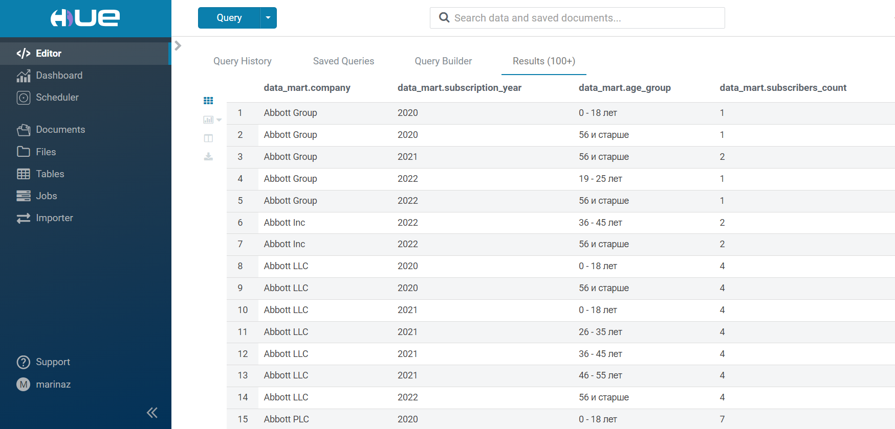

# Задание 4.5 Hive
```
Двигаемся дальше, и теперь на очереди — Hive!

Первым делом нужно достать данные — заходим и грузим все, что есть из репозитория: GitHub.

Эти файлы будут подвержены анализу, но в них кое-чего недостает — добавьте в каждый файл столбец с номером группы таким 
образом, чтобы файл был разделен на 10 групп. В файл customers.csv добавьте столбец с номером года, в который была 
совершена подписка (Subscription Date). Используйте средства python + pandas.

Загрузите полученные файлы на hdfs. 

Теперь ваша задача следующая: аналитики хотят сводную статистику на уровне каждой компании и на уровне каждого года 
получить целевую возрастную группу подписчиков — то есть, возрастную группу, представители которой чаще всего совершали 
подписку именно в текущий год на текущую компанию. 

Все операции необходимо выполнить в Hive. Работать с Hive можно через интерфейс HUE, если перейти в раздел «Query», или 
выбрав нужный пункт в разделе «Editor».

Таким образом вам нужно создать под каждый csv-файл отдельную таблицу. Для оптимизации используйте свои знания 
партиционирования и бакетирования. А затем на основе 3-х таблиц собрать витрину, которая решает поставленную задачу. 
В качестве результата предоставьте код SQL-запросов для создания исходных таблиц и создания итоговой витрины.

Результат выполнения задания необходимо выложить в github/gitlab и указать ссылку на Ваш репозиторий 
(не забудьте: репозиторий должен быть публичным).
```

## Описание проекта:

### 1. Необходимо скачать на компьютер все файлы и папки из репозитория по ссылке: https://github.com/mazavlia/1T_Data_Engineer/tree/main/Theme_4_5_Hive;

### 2. Перейти в терминале в папку [docker-hadoop-hive-parquet](docker-hadoop-hive-parquet) и ввести команду <u>***docker-compose up -d***</u>;

### 3. Начать работу в Hive можно любым удобным способом:
  - Веб-интерфейс Hue по адресу: http://localhost:8888/hue
  - Программа DBeaver с настройками подключения:
      + type connect: Apache Hive, 
      + host: localhost, 
      + port: 10000, 
      + ввести имя пользователя и пароль;
  
### 4. Открыть файл [Hive.ipynb](Hive.ipynb) и последовательно запустить каждую ячейку кода. Hive.ipynb скачает .csv файлы таблиц из репозитория, преобразует их (как требуется в техзадании) и сохранит на локальный диск в папку [csv_files](csv_files);

### 5. Перекинуть .csv файлы в систему Hive на примере [commands.txt](commands.txt);

### 6. Запустить sql-скрипт с кодом формирования таблиц и запросов: [scripts.sql](scripts.sql)


## Прилагаемые файлы:

### 1. Файл витрины данных в формате .csv: [query-hive.csv](query-hive.csv);

### 2. Файл - скрин вывода на экран сформированного запроса для создания витрины данных и записи его в таблицу data_mart: 
