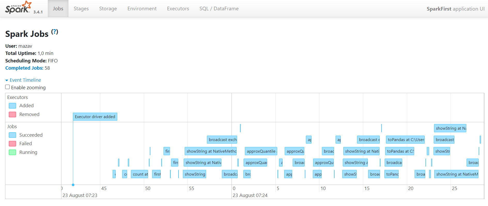

# Задание 4.7 ETL/ELT-процессы. Введение Apache Spark
```
Задание
Загрузите файл: GitHub - online_retail.xlsx

Выполните следующую логику: 

1. С помощью модуля pandas преобразуйте файл из .xlsx в .csv формат

2. Инициализируйте Spark-сессию

3. Создайте dataframe из скачанного файла

4. Подсчитайте следующие показатели:

  a) Количество строк в файле
  b) Количество уникальных клиентов
  c) В какой стране совершается большинство покупок
  d) Даты самой ранней и самой последней покупки на платформе

5. Проведите RFM-анализ клиентов платформы. Что такое RFM-анализ? Обычно RFM-анализ используется в маркетинге для оценки ценности клиента на основе его:

  a) Recency - Давность: как давно каждый покупатель совершил покупку?
  b) Frequency- Частота: Как часто они что-то покупали?
  c) Monetary - Денежная ценность: сколько денег они в среднем тратят при совершении покупок?

Добавьте в dataframe для каждого клиента 3 новых поля recency, frequency, monetary

Для каждого показателя добавьте стобец с разбиением клиентов на 3 группы. Допустим, у нас есть 3 
клиента, первый клиент последний раз купил товар только в прошлом году, второй клиент в прошлом месяце, 
а третий клиент на прошлой неделе. Каждый из этих клиентов должен получить различные значения группы для 
показателя Recency - A, B и С, где А - отражает наибольшую “ценность”, а С - соответственно, наименьшую. 

Добавьте итоговый столбец с “суммой” значений групп по каждому показателю и сохраните в отдельный 
csv-файл Id только тех клиентов, у которых значения групп ААА.

В качестве результата вам необходимо предоставить код написанный на spark или pyspark, а также итоговый 
файл. 

Результат выполнения задания необходимо выложить в github/gitlab и указать ссылку на Ваш репозиторий (не 
забудьте: репозиторий должен быть публичным).
```

## Описание проекта:

### 1. Файл [Jupyter Notebook](retail.ipynb) с кодом выполнения задания;

### 2. Файл [online_retail.xlsx](online_retail.xlsx), скачанный по ссылке с GitHub;

### 3. Измененный формат файла для начала работы [online_retail.csv](online_retail.csv);
  
### 4. Файл с результатом [result.csv](result.csv);

### 5. Spark Jobs: 